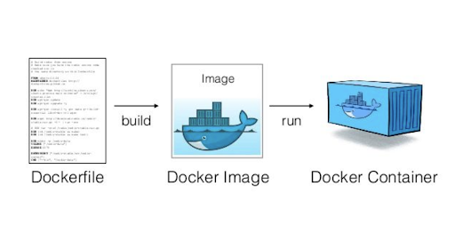

# What is Docker?

*If you already have an overall knowledge about Docker, you can fast forward by clicking here.*

Docker is a service that enables developers to run software virtually anywhere, without having to worry about aspects of the environment (for example dependencies, libraries and different OS:es). It enables this by ultimately providing isolated containers in which the software is run. What containers are and how they are created will be explained below.

/katacoda-scenarios/dockertutorial/assets/1.png

A project is dockerized by creating a so-called Dockerfile in the root folder of the project. The Dockerfile is a text file that contains commands to assemble a Docker image. A Docker image could be compared with the term “snapshot”, that is common when discussing virtual machines (VMs). These images can be shared with other people who can open them on their own VM and thereby, get the exact same environment. A Docker container is an instance of a Docker Image. Docker containers are self contained processes and can be modified during runtime. This means that they are isolated from each other on your computer and that processes will never share memory or a file system. Multiple Docker containers can be created from one image. Changes can be done in the container, which then needs to be built into a new image if they are wished to be saved. In the image above, you can see a visual representation of the three central concepts.